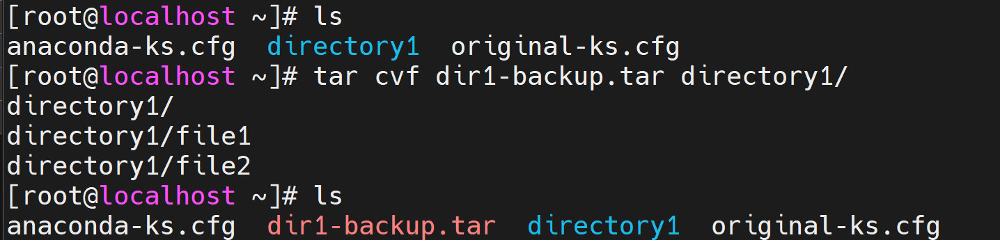
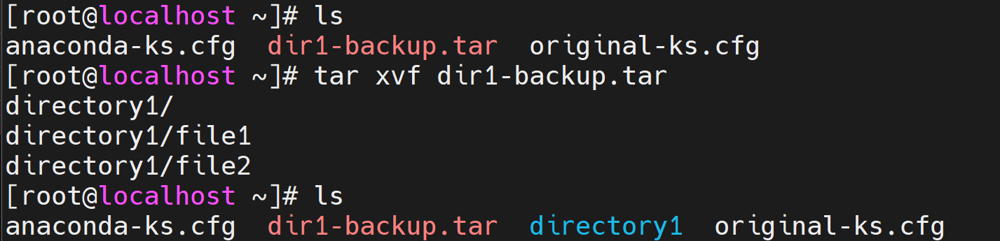
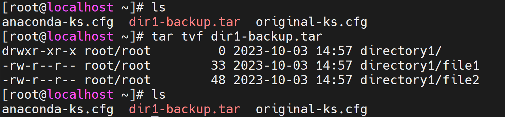
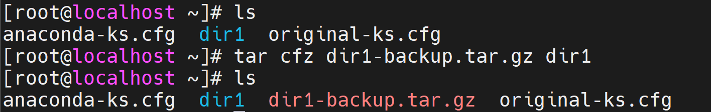
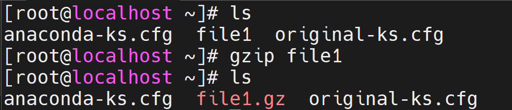
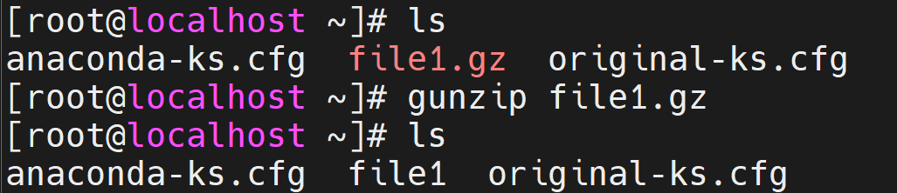
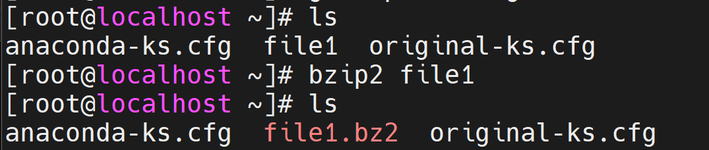
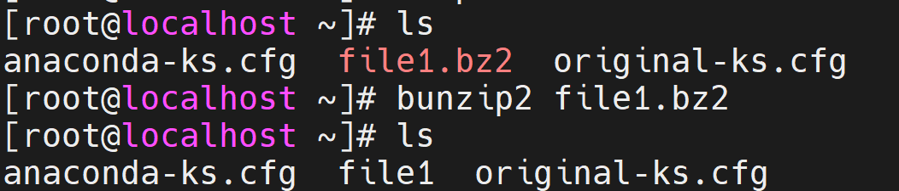

# Archiving

- Behind the phrase **"data archiving"** is the basic idea of **backing up** files or entire directories and storing them in a secure location, often in a compressed form .<br/><br/>
- the packing program `tar` (short for tape archiver) can help pack up files and directories into **a single data file** .<br/><br/>

<div align="center">
    
</div>
<br/>

- the general form of the `tar` command is :

```
tar    [options]    archive-name.tar    files and directories to be archived 
```

|Option| Description |
|------|-------------|
| c | Creating a new archive made from the files selected .|
| v | verbose, this is the reason why the command displays the files added to the archive when executing it .|
| f | file, to specify the filename of the archive we want to create.|
| x | extracting (restoring) files .|
| t | listing the content of the archive without restoring it.|
| z | compressing the archive file with gzip .|
| j | compressing the archive file with bzip2 .|

note : the data format of the archive is **.tar**<br/><br/>

- option **c** : 
<div align="center">
        
    </div>
<br/>

- option **x** :
<div align="center">
    
</div>
<br/>

- option **t** :
<div align="center">
    
</div>
<br/>

- option **z** :
<div align="center">
    
</div>

note: the data format of the compressed archive file with gzip is **.tar.gz** <br/><br/>

- option **j** :
<div align="center">
    
</div>

note : the data format of the compressed archive file with bzip2 is  **.tar.bz2** 
<br/><br/>

___

# Compressing 

- as for **"data compression"**, the main idea is to **reduce the size** of the files to free up more disk space.<br/><br/>

<div align="center">
    
</div>
<br/>

- here are some of the most popular compression algorithms : 
    1. gzip (GNU zip) :- 
        - The gzip command is very simple to use. You just type **"gzip"** followed by the **name of the file** you want to compress. gzip will encrypt the files "in place". In other words, the original file              will be replaced by the encrypted file.<br/><br/>

        note: the data format of the compressed file with gzip is **.gz**<br/><br/>

        - for **compression** we use the command `gzip`

        <div align="center">
            
        </div><br/><br/>

        - for **decompression** we use the command `gunzip`

        <div align="center">
            
        </div><br/><br/>


    2. bzip2 :-
        -the  bzip2 command will compress the file that you select "in place"  like gzip .<br/><br/>

        note : the data format of the compressed file with bzip2 is **.bz2**<br><br/>

        - for **compression** we use the command `bzip2`

        <div align="center">
            
        </div><br/><br/>

        - for **decompression** we use the command `bunzip2`

        <div align="center">
            
        </div><br/><br/>