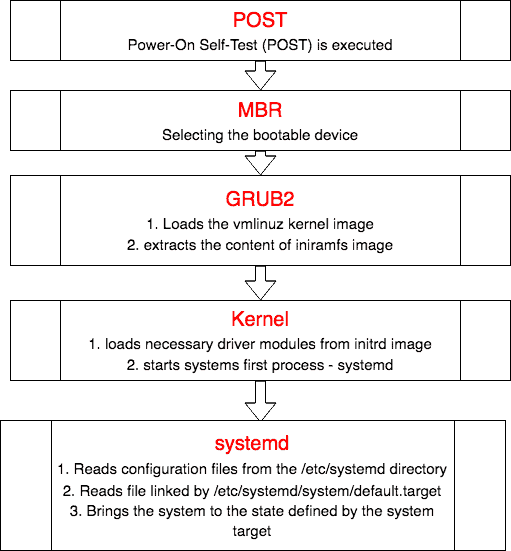
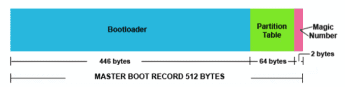
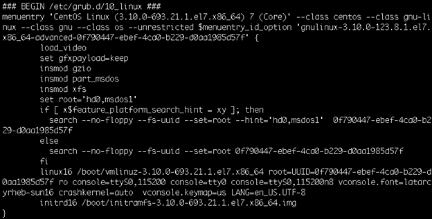

# Booting process
### 1. The computer’s BIOS performs POST.
### 2. BIOS reads the MBR for the bootloader.
### 3. GRUB 2 bootloader loads the vmlinuz kernel image.
### 4. GRUB 2 extracts the contents of the initramfs image.
### 5. The kernel loads driver modules from initramfs.
### 6. Kernel starts the system’s first process, systemd.
### 7. The systemd process takes over. It:
      


<div align="center">
   
 </div>


## 1.POST (Power on Self Test)
From the system firmware, which can be the modern Universal Extended Firmware Interface (**UEFI**) or the classical Basic Input Output System (**BIOS**), the Power-On Self-Test (POST) is executed, and the hardware that is required to start the system is initialized.

 
## 2.Selecting the bootable device (With MBR)

- Master Boot Record (MBR) is the first 512 bytes of the boot drive that is read into memory by the BIOS.

<div align="center">
   
 </div>


- The next 64 bytes contain the partition table for the disk. The last two bytes are the “Magic Number” which is used for error detection.
- MBR discovers the bootable device and loads the GRUB2 boot loader into memory and transfers control over to it.

## 3. Loading the boot loader (GRUB2)
- The default bootloader program used on RHEL 7 is GRUB 2. GRUB stands for **GRand Unified Bootloader**. GRUB 2 replaces the older GRUB bootloader also called as legacy GRUB.
- The GRUB 2 configuration file is located at `/boot/grub2/grub.cfg`  (Do not edit this file directly).

<div align="center">
   
 </div>

- GRUB 2 menu-configuration settings are taken from `/etc/default/grub` when generating `grub.cfg`.
- Sample /etc/default/grub file :
``` bash
# cat /etc/default/grub
GRUB_TIMEOUT=5
GRUB_DEFAULT=saved
GRUB_DISABLE_SUBMENU=true
GRUB_TERMINAL_OUTPUT="console"
GRUB_CMDLINE_LINUX="rd.lvm.lv=rhel/swap crashkernel=auto rd.lvm.lv=rhel/root rhgb quiet net.ifnames=0"
GRUB_DISABLE_RECOVERY="true"

```
- If changes are made to any of these parameters, you need to run **grub2-mkconfig** to re-generate the /boot/grub2/grub.cfg file
```
# grub2-mkconfig –o /boot/grub2/grub.cfg
```
- GRUB2 searches the compressed kernel image file also called as vmlinuz in the /boot directory.
- GRUB2 loads the vmlinuz kernel image file into memory and extracts the contents of the initramfs image file into a temporary, memory-based file system (tmpfs).
- The initial RAM disk (initrd) is an initial root file system that is mounted before the real root file system.
### initramfs
- The job of the initial RAM file system is to preload the block device modules, such as for IDE, SCSI, or RAID, so that the root file system, on which those modules normally reside, can then be accessed and mounted.
- The initramfs is bound to the kernel and the kernel mounts this initramfs as part of a two-stage boot process.
- The dracut utility creates initramfs whenever a new kernel is installed.
- Use the lsinitrd command to view the contents of the image created by dracut:

## 4. Loading the kernel
- The kernel starts the systemd process with a process ID of 1 (PID 1).
- It also loads the necessary driver modules from initrd image.
- The boot loader (GRUB2) may present a boot menu to the user, or can be configured to automatically start a default operating system.
- To load Linux, the kernel is loaded together with the initramfs. The initramfs contains kernel modules for all hardware that is required to boot, as well as the initial scripts required to proceed to the next stage of booting.
- On RHEL 7, the initramfs contains a complete operational system (which may be used for troubleshooting purposes).

## 5. Starting systemd
- The kernel starts the systemd process with a process ID of 1 (PID 1).
```
root          1      0  0 02:10 ?        00:00:02 /usr/lib/systemd/systemd --switched-root --system --deserialize 23
```
- systemd is the first process that starts after the system boots, and is the final process that is running when the system shuts down.
- It controls the final stages of booting and prepares the system for use. It also speeds up booting by loading services concurrently.

| Boot Phase | Configuration|
|---|---|
| POST |Hardware Configuration (F2, ESC, F10 or another key) |
| Select bootable Device |BIOS/UEFI configuration or hardware boot menu |
| Loading the boot loader |grub2-install and edits to /etc/defaults/grub |
| Loading the kernel |Edits to the GRUB configuration and /etc/dracut.conf |
| starting /sbin/init |Compiled into initramfs |
| Processing initrd.target |Compiled into initramfs |
| Switch to the root filesystem | /etc/fstab |
| Running the default target |/etc/systemd/system/default.target |


