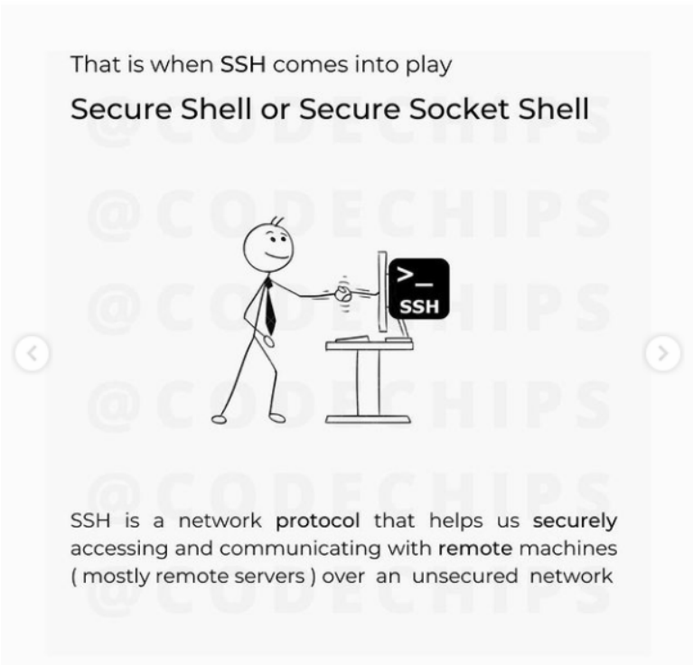
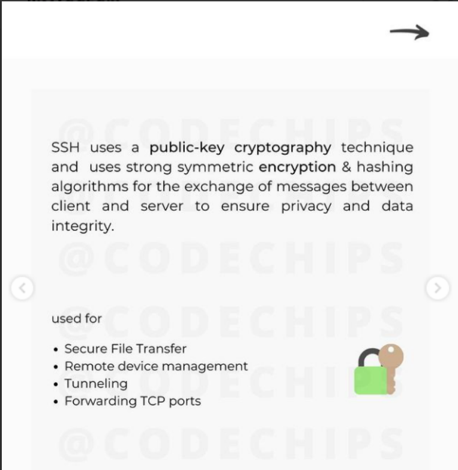

# OpenSSH 


<br/>

<br/>


<br/>

<br/>







## How To Create SSH Key
 SSH keys should be generated on the computer you wish to log in from. This is usually your local machine

 ``````bash
    ssh-keygen -t rsa
 ``````
 our keys will be created at `~/.ssh/id_rsa.pub and ~/.ssh/id_rsa`.

 Change into the .ssh directory
 ``````bash
 cd .shh
 ``````
 look at the permisions of the files
 ``````bash
    ls -l
 ``````
 As you can see, the id_rsa file is readable and writable only to the owner. This helps to keep it secret.

 The id_rsa.pub file, however, can be shared and has permissions appropriate for this activity

--------------------
### How To transfer Key to Server
 If you currently have password-based access to a server, you can copy your public key to it by issuing this command
 ``````bash
    ssh-copy-id remote_host
 ``````
 *This will start an SSH session. After you enter your password, it will copy your public key to the server’s authorized keys file, which will allow you to log in without the password next time*

-----------------------
 
### client-side commands
 For instance, if you changed the port number in your sshd configuration, you will need to match that port on the client-side by typing:
 ``````bash
 ssh -p port_number remote_host
 ``````

 If you only want to execute a single command on a remote system, you can specify it after the host like so
  ``````bash
  ssh remote_host command_to_run
  ``````

-----------------------
### Disabling  Password Authentication
 if you have created SSH keys, you can enhance your server’s security by disabling password-only authentication. Apart from the console, the only way to log into your server will be through the private key that pairs with the public key you have installed on the server.

 ***Warning***: Before you proceed with this step, be sure you have installed a public key to your server. Otherwise, you will be locked out!.
 

 As root or user with sudo privileges, open the sshd configuration file:
 ``````bash
    sudo nano /etc/ssh/sshd_config
 ``````
 Locate the line that reads `Password Authentication`, and uncomment it by removing the leading #. You can then change its value to `"no"`

 Two more settings that should not need to be modified (provided you have not modified this file before) are `PubkeyAuthentication` and `ChallengeResponseAuthentication`. They are set by default, and should read as follows:
 ``````bash
 PubkeyAuthentication yes
 ChallengeResponseAuthentication no
 ``````

 After making your changes, save and close the file
 ``````bash
    sudo systemctl reload ssh
 ``````

---------------------
#### summary
 ``````bash
  ssh host           # Connect to host as your local username.
  ssh user@host           # Connect to host as user
  ssh -p port user@host   # Connect to host using port
  ssh-keygen              # Create a new SSH key pair.
  ssh-copy-id user@host   # Copy SSH key to the remote host to enable passwordless logins for user.
 ``````
--------------------------------
 ### The End
 Thanks for Your Attention 🤗🫡


 [References of Animation](https://www.youtube.com/@codechipsyt)

-------------------------
#### [outlines](../README.md)

