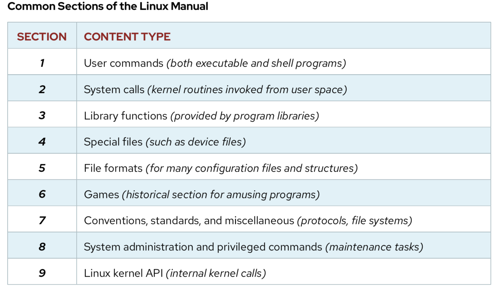
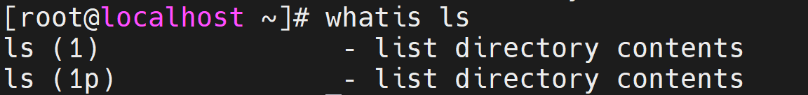
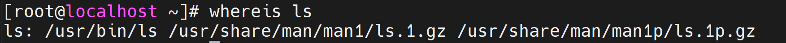

# Getting Help In Linux

### ( 1 ) Man :

- The `man` command shows **detailed manuals** for each command. These are referred to as **man pages**.
- for example: we want to show the man page for the command `ls`

```
   man   ls
```

<br/>

- man pages sections (chapters) :
<div align="center">
    
</div>
<br/>

- navigateing man pages using: g, G,n, N,/, space bar.
- options: k, K.

---

### ( 2 ) Info :

- Like the man pages, the info pages also give you a detailed description of a specific command. Sometimes, the info pages contain **more details than the man pages**.
- for example: we want to show the info page for the command `ls`

```
   info   ls
```

---

### ( 3 ) Wh commands :

##### 1. Whatis :

- The `whatis` command shows a **one-line summary** of a command, taken from its man page. It's a quick way of seeing what a command actually does.
- for example :

```
   whatis ls
```

<div align="center">
    
</div>
<br/><br/>

##### 2. Whereis :

- The `whereis` command shows the location of the command binary file and man page.
- for example :

```
   whereis ls
```

<div align="center">
    
</div>
<br/>

---

### ( 4 ) Help :

- run any command with the `--help` option. You'll see usage information and a list of options for this command.
- for example :

```
    ls  --help
```

---

### ( 5 ) Online Documentation & Communities :

- [RedHat Documentation](https://access.redhat.com/products/) .
- [Linux Questions](https://www.linuxquestions.org/) .
- [Fedora Forum](https://forums.fedoraforum.org/forum.php) .
- [Nix Craft](https://www.nixcraft.com/categories) .
- [How to Forge](https://www.howtoforge.com/).

---

<br />

### [outlines](../README.md)
