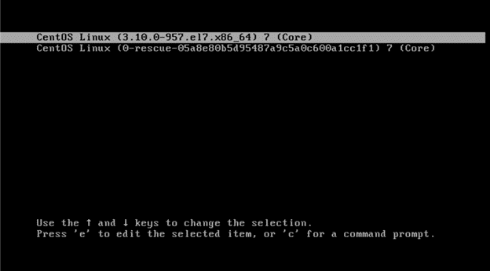
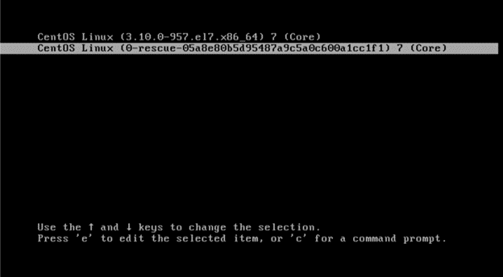
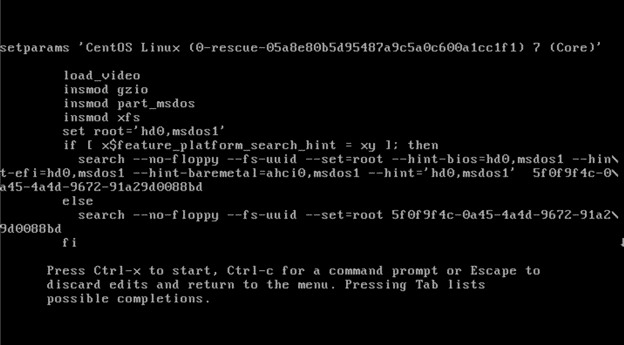
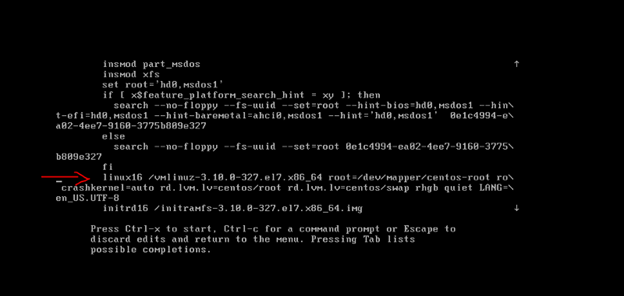
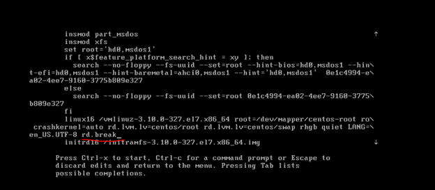
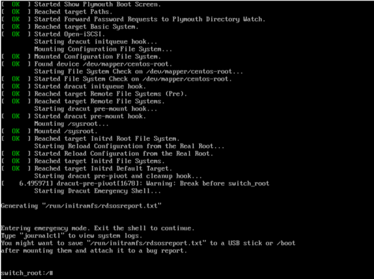
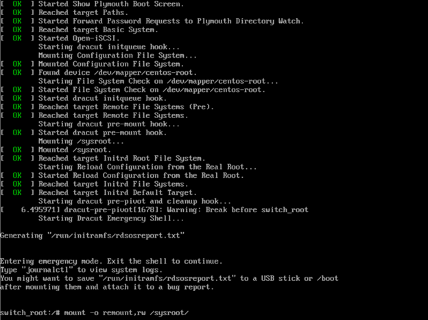

# How To Reset Root Password On CentOS 7

### First, reboot the system.

<div align="center">
    
</div>
<br/>


### Interrupt the boot loader countdown by pressing any key.
### Move the cursor to the entry that needs to be booted.

<div align="center">
    
</div>
<br/>

###  Press  `( e )` to select that entry. After selecting that entry, the below kernel commands will appear.


<div align="center">
    
</div>
<br/>

### In the kernel command line, move the cursor to the line that starts with linux16.

<div align="center">
    
</div>
<br/>

### Press the “End” key to move the cursor to the end of it. Type `( rd.break )` (This will break just before control is handed from the initramfs to the actual system).

<div align="center">
    
</div>
<br/>

### Then press `Ctrl+x` to save those changes. The Initramfs debug shell will appear.

<div align="center">
    
</div>
<br/>

### Next, we have to provide read and write permissions to /sysroot by typing the below command
```
mount -o remount,rw /sysroot/
```

<div align="center">
    
</div>
<br/>

### Now access the system with this command
```
chroot /sysroot
```
### Reset the password
```
passwd root
```

### Update selinux information
```
touch /.autorelabel
```

### Exit Chroot
```
exit
```
### Reboot your system
```
reboot
```