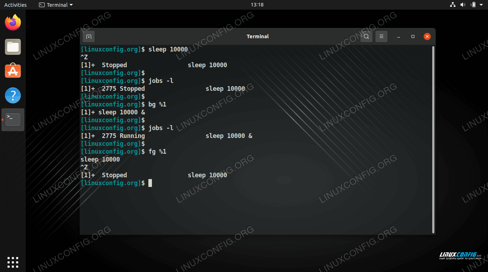

# Process Management

### outlines:

##### 1. Process vs Program

##### 2. Shared Memory

##### 3. Process ID vs Parent Process ID

##### 4. Process Control ( ps and kill )

##### 5. Jobs Control ( fg and bg )

##### 6. Process Priority ( nice value )

---

## 1. Process vs Program

**_A Program is an executable file which contains a certain set of instructions written to complete the specific job or operation on your computer. A Process is an execution of a specific program._**

    

---

## 2. Shared Memory

**_Shared memory is an operating-system feature that allows the database server threads and processes to share data by sharing access to pools of memory._**

      
    

---

## 3. Process ID vs Parent Process ID

**_If a command starts just one process, its PID and PGID are the same. A process that creates a new process is called a parent process; the new process is called a child process. The parent process ID (PPID) becomes associated with the new child process when it is created. The PPID is not used for job control._**

      
    

---

## 4. Process Control ( ps and kill )

**_Process control is the ability to monitor and adjust a process to give a desired output. It is used in industry to maintain quality and improve performance. An example of a simple process that is controlled is keeping the temperature of a room at a certain temperature using a heater and a thermostat._**

      
      
      
      
      
      
      
      
      
      
      
      
      
      
      
      
      

---

## 5. Jobs Control ( fg and bg )

**_Jobs Command : Jobs command is used to list the jobs that you are running in the background and in the foreground. If the prompt is returned with no information no jobs are present. All shells are not capable of running this command. This command is only available in the csh, bash, tcsh, and ksh shells._**

      
      
      

---

## 6. Process Priority ( nice value )

**_The running instance of program is process, and each process needs space in RAM and CPU time to be executed, each process has its priority in which it is executed._**

**_The column NI represents nice value of a process. It’s value ranges from -20 to 19 (on most unix like operating systems)._**

      
    

#### **Nice Value**

`nice -n nice_value command`

`nice -n 15 firefox`

#### **Renice value**

`renice -n nice_value command`

`renice -n nice_value firefox`

---

### [outlines](../README.md)
