# Files and Directories

first we must know how we can **navigate** between _Dirs_

## To navegate between dirs

```
cd /path
```

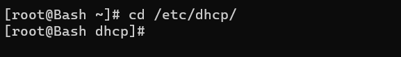

---

## To print current working directory

```
pwd
```

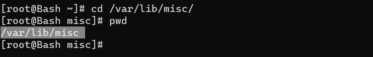

---

---

## To list files and directories within the current directory

```
ls
```

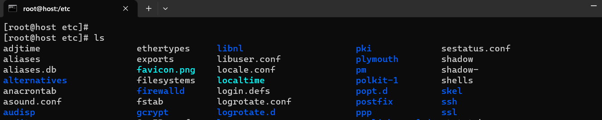

**ls options**

```
ls --help
```

## To displays the director in a tree-like format

```
tree [path]
```

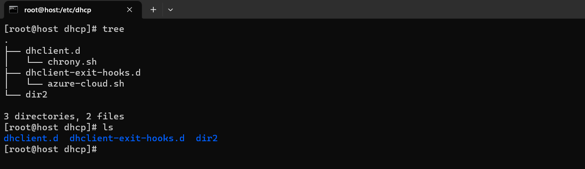

---

# Files

**To copy File**

```
cp file_name new_file_name
```

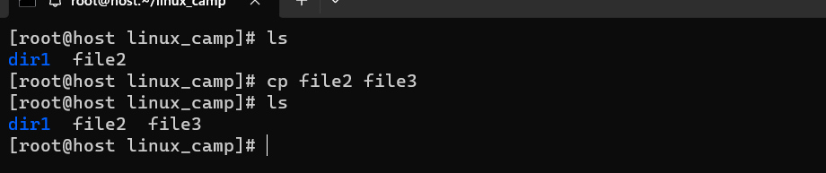

---

## To move or rename files and directories

```
mv name new_name
```

**To delete file**

```
rm file_name
```

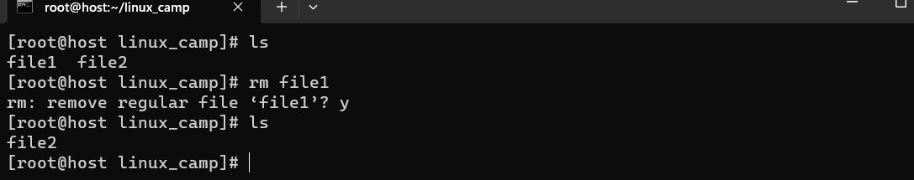
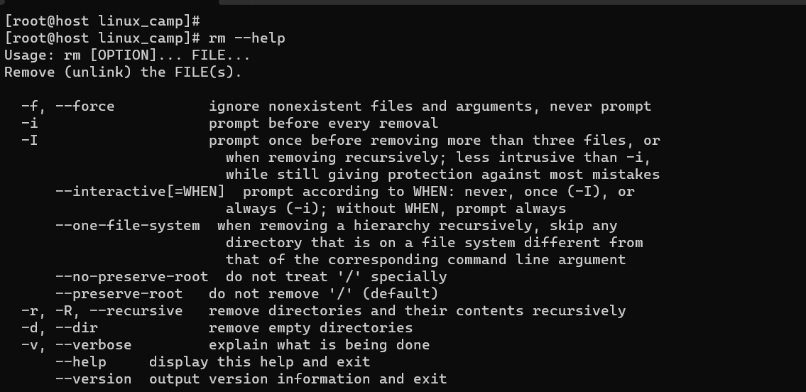

---

# directories

## Create and delete Directories

**1. to create directory**

```
mkdie dir_name

```

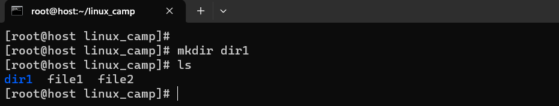
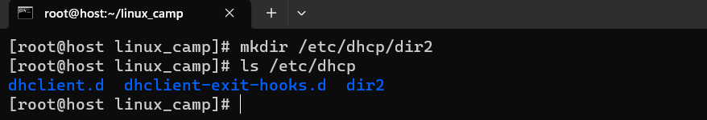

---

**2. to delete directory**

```
rmdir dir_name
```

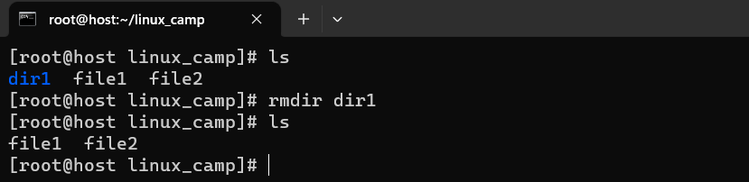

---

## To copy directories

```
cp -r dir_name new_dir_name
```

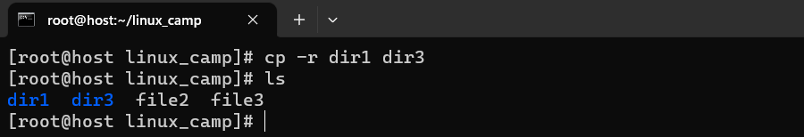

---

## To move or rename directories

```
mv dir_name new_dir_name
```

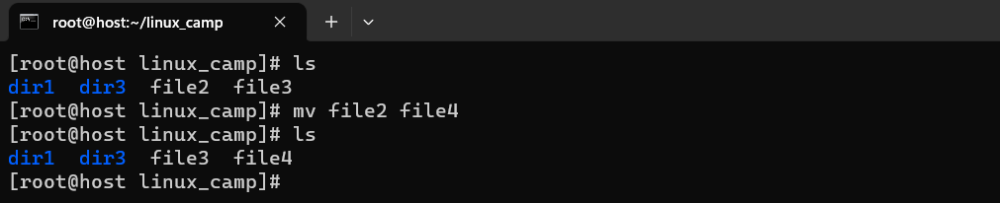

---

## Show cut

- **ctrl + a** ====> makes you stand at the beginning of the line
- **ctrl + e** ====> makes you stand at the end of the line
- **ctrl + l** ====> to clear your screen
- **ctrl + c** ====> to kill any proccess
- **ctrl + d** ====> to exit

<br />

### [outlines](../README.md)

---

Author: Marwan Ali
