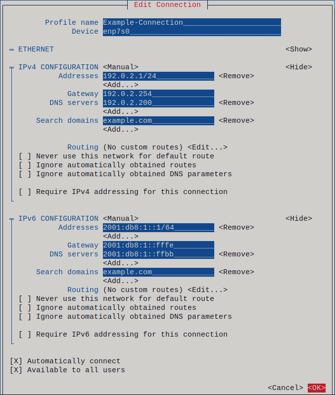

# Network in Linux operating System 


## 1. network componenet 
 <div align="center">
   
 </div>

### 1.1  what is IP address
  *An IP address is a unique address that identifies a device on the internet or a local network. IP stands for "Internet Protocol," which is the set of rules governing the format of data sent via the internet or local network.*

  In essence, IP addresses are the identifier that allows information to be sent between devices on a network: they contain location information and make devices accessible for communication. The internet needs a way to differentiate between different computers, routers, and websites. IP addresses provide a way of doing so and form an essential part of how the internet works.

  IP addresses are not random. They are mathematically produced and allocated by the Internet Assigned Numbers Authority (IANA), a division of the Internet Corporation for Assigned Names and Numbers (ICANN).

### 1.2 IP adress versions
   - IPv4
   - IPv6
   
### 1.3 Types of IP address
 There are different categories of IP addresses, and within each category, different types.
 
 - __Consumer IP addresses__
    Every individual or business with an internet service plan will have two types of IP addresses: their private IP addresses and their public IP address. The terms public and private relate to the network location — that is, a private IP address is used inside a network, while a public one is used outside a network.

 - __Private IP__
   Every device that connects to your internet network has a private IP address. This includes computers, smartphones, and tablets but also any Bluetooth-enabled devices like speakers, printers, or smart TVs. With the growing internet of things, the number of private IP addresses you have at home is probably growing. Your router needs a way to identify these items separately, and many items need a way to recognize each other. Therefore, your router generates private IP addresses that are unique identifiers for each device that differentiate them on the network.

 - __Public IP__
   A public IP address is the primary address associated with your whole network. While each connected device has its own IP address, they are also included within the main IP address for your network. As described above, your public IP address is provided to your router by your ISP. Typically, ISPs have a large pool of IP addresses that they distribute to their customers. Your public IP address is the address that all the devices outside your internet network will use to recognize your network. 

### 1.4 IP address class  
      32-bit address           xxxxxxxx xxxxxxxx xxxxxxxx xxxxxxxx
 
    Class A                  0xxxxxxx xxxxxxxx xxxxxxxx xxxxxxxx
                   min       00000000
                   max       01111111
                   range     1 - 126    (decimal notation; 0 and 127 are reserved)
 
    Class B                  10xxxxxx xxxxxxxx xxxxxxxx xxxxxxxx
                   min       10000000
                   max       10111111
                   range     128 - 191  (decimal notation)
 
    Class C                  110xxxxx xxxxxxxx xxxxxxxx xxxxxxxx
                   min       11000000
                   max       11011111
                   range     192 - 223  (decimal notation)
 
    Class D                  1110xxxx xxxxxxxx xxxxxxxx xxxxxxxx
                   min       11100000
                   max       11101111
                   range     224-239 (decimal notation)
 
------------------

## 2. Overview
 There are multiple ways to configure the network in modern Linux systems. The most popular are using Network Manager and Systemd. 
 In this tutorial, we’ll see how to configure the network using the configuration files and Network Manager.

--------------
## 3. What Is a Network Interface?
 Simply, a network interface is the point of connection between a computer and a network. In other words, how the Linux system links up the software side of networking to the hardware side.

----------------
### 3.1 Network Interface Types
 The Linux system distinguishes two types of network interfaces – the physical network interface and the virtual network interface.

 A physical network interface represents a network hardware device such as NIC (Network Interface Card), WNIC (Wireless Network Interface Card), or a modem.

 A virtual network interface does not represent a hardware device but is linked to a network device. It can be associated with a physical or virtual interface, we called loopback interface.

 A virtual network interface is local significant,if I have local service and I have no a physical intreface, I can make service listen on loopback interface

--------------------
### 3.2 Network Interface Name
 Linux systems use two different styles of naming the network interfaces. The first style is the old-style name, such as eth0, eth1, and wlan0. The new ones are based on hardware locations like enp3s0 and wlp2s0.

 So, we can use the ls command and the sys file system to quickly list the available network interfaces. Each entry in the `/sys/class/net` directory represents a physical or virtual network interface:
 
 $ `ls /sys/class/net`

 To get more details about the network interfaces. we can use the ip link command:

 ``````bash
 $ ip link 
 1: lo: <LOOPBACK,UP,LOWER_UP> mtu 65536 qdisc noqueue state UNKNOWN mode DEFAULT group default qlen 1000
    link/loopback 00:00:00:00:00:00 brd 00:00:00:00:00:00
 2: eth0: <BROADCAST,MULTICAST,UP,LOWER_UP> mtu 1500 qdisc fq_codel state UP mode DEFAULT group default qlen 1000
    link/ether 54:ee:74:c1:19:92 brd ff:ff:ff:ff:ff:ff
 3: wlan0: <BROADCAST,MULTICAST> mtu 1500 qdisc noqueue state DOWN mode DEFAULT group default qlen 1000
    link/ether 52:54:00:f0:27:9a brd ff:ff:ff:ff:ff:ff permaddr 94:e9:79:fd:51:5d
 ``````

-----------------------------
## 4. Netwrok Impelmentation
   there are 2 Network implementation
   - network service
   - Network Manager
  
 note:
   if you want to manage network interfaces by network service, you should do this instractions
   1. chkconfig NetworkManager off
      ``````bash
       systemctl stop NetworkManager
       systemctl disable Networkmanager
      ``````
   2. vi `/etc/sysconfig/network-scripts/ifcfg-eth0`
      a. Change NM_Controlled="yes" to "no"
      b. Change ONBOOT="no" to "yes"
       ``````bash
         NAME="eth0"
         HWADDR=...
         ONBOOT=yes
         BOOTPROTO=none
         IPADDR=...
         NETMASK=...
         GATEWAY=...
         TYPE=Ethernet
         NM_CONTROLLED=no
      ``````
   3. add name server to file `/etc/resolv.conf`
      ``````bash
      nameserver1 8.8.8.8
      nameserver2 4.4.2.2
      ``````


-----------------------------
## 5. Network Manger
  NetworkManager creates a connection profile for each Ethernet adapter that is installed in a host. By default, this profile uses DHCP for both IPv4 and IPv6 connections. Modify this automatically-created profile or add a new one in the following cases:
 - The network requires custom settings, such as a static IP address configuration.
 - You require multiple profiles because the host roams among different networks.
  
 Red Hat Enterprise Linux provides administrators different options to configure Ethernet connections. For example:

 - Use `nmcli` to configure connections on the command line.
 - Use `nmtui` to configure connections in a text-based user interface.
 - Use the GNOME Settings menu or `nm-connection-editor` application to configure connections in a graphical interface.
 - Use `nmstatectl` to configure connections through the Nmstate API.
 - Use RHEL System Roles to automate the configuration of     connections on one or multiple hosts.
-------------------------------- 
### 5.1 Configuring an Ethernet connection by using nmcli
 If you connect a host to the network over Ethernet, you can manage the connection’s settings on the command line by using the nmcli utility.

 __Prerequisites__
   * physical or virtual Ethernet Network Interface Controller (NIC) exists in the server’s configuration.

 __Procedure__
 1. List the NetworkManager connection profiles:
    ````bash
    nmcli connection show
    ``````
    *By default, NetworkManager creates a profile for each NIC in the host. If you plan to connect this NIC only to a specific network, adapt the automatically-created profile. If you plan to connect this NIC to networks with different settings, create individual profiles for each network.*


 2. If you want to create an additional connection profile, enter:
    ``````bash

    nmcli connection add con-name <connection-name> ifname <device-name> type ethernet

    ``````

    *Skip this step to modify an existing profile.*

 3. Optional: Rename the connection profile:
    ``````bash
    nmcli connection modify "Wired connection 1" connection.id "Internal-LAN"
    ``````
 4. Display the current settings of the connection profile:
     ``````bash
    nmcli connection show Internal-LAN
    ``````    
 5. Configure the IPv4 settings:
    - To use DHCP, enter:
        ``````bash
        nmcli connection modify Internal-LAN ipv4.method auto
        ``````
    - To set a static IPv4 address, network mask, default gateway, DNS servers, and search domain, enter:
        ``````bash
        nmcli connection modify Internal-LAN ipv4.method manual ipv4.addresses 192.0.2.1/24 ipv4.gateway 192.0.2.254 ipv4.dns 192.0.2.200 ipv4.dns-search example.com
        ``````
 6. Configure the IPv6 settings:
    - To use stateless address autoconfiguration (SLAAC), enter:
        `nmcli connection modify Internal-LAN ipv6.method auto`
    - To set a static IPv6 address, network mask, default gateway, DNS servers, and search domain, enter:
        ````bash
        nmcli connection modify Internal-LAN ipv6.method manual ipv6.addresses 2001:db8:1::fffe/64 ipv6.gateway 2001:db8:1::fffe ipv6.dns 2001:db8:1::ffbb ipv6.dns-search example.com
        ``````


 7. To customize other settings in the profile, use the following command:
    `nmcli connection modify <connection-name> <setting> <value>`


 8. Activate the profile:
    ````bash
    nmcli connection up Internal-LAN
    `````
__Troubleshooting__

 * Verify that the network cable is plugged-in to the host and a switch.
 * Check whether the link failure exists only on this host or also on other hosts connected to the same switch.
 * Verify that the network cable and the network interface are working as expected. Perform hardware diagnosis steps and replace defect cables and network interface cards. 
 * If the configuration on the disk does not match the configuration on the device, starting or restarting NetworkManager creates an in-memory connection that reflects the configuration of the device.
-------------------------------
### 5.2 Configuring an Ethernet connection by using nmtui
 If you connect a host to the network over Ethernet, you can manage the connection’s settings in a text-based user interface by using the nmtui application. Use nmtui to create new profiles and to update existing ones on a host without a graphical interface.

 __Prerequisites__
 - A physical or virtual Ethernet Network Interface Controller (NIC) exists in the server’s configuration.
  
 __Procedure__
  1. If you do not know the network device name you want to use in the connection, display the available devices
   `nmcli device status`
  2. start nmtui
    `nmtui`
   <div align="center">
     
   </div>


