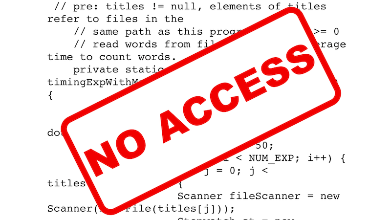
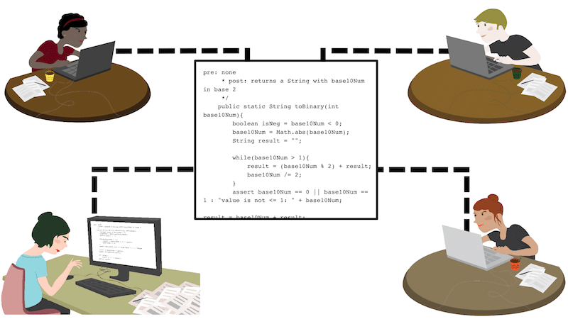
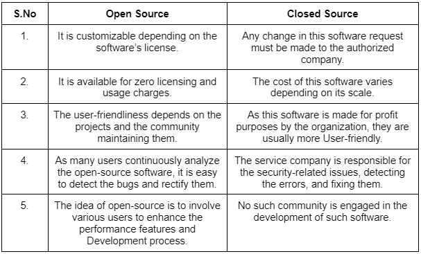
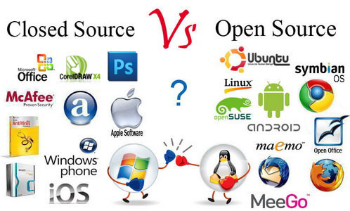

# Project Source

- ### Open Source
  _Open source software is software with source code that anyone can inspect, modify, and enhance._

    

---

- ### Closed Source
  _Closed-source software refers to software products whose creators restrict the use of its source code._

    

---

- ### Open Source vs Closed Source

    

---

- ### Examples

    

