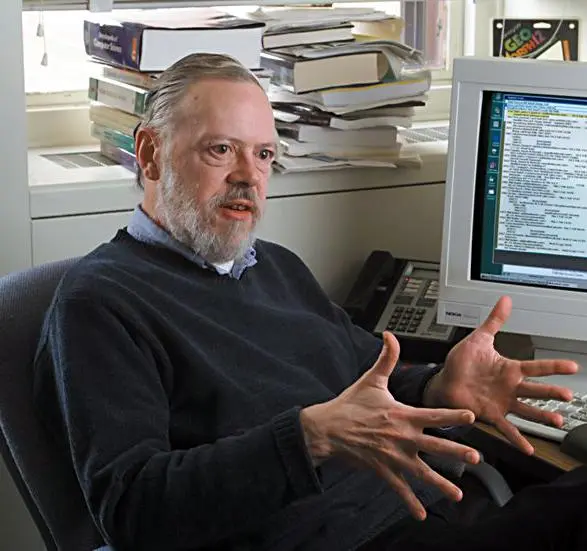
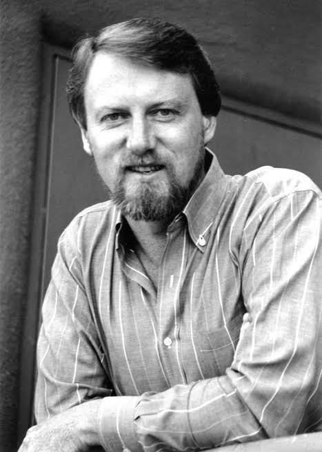
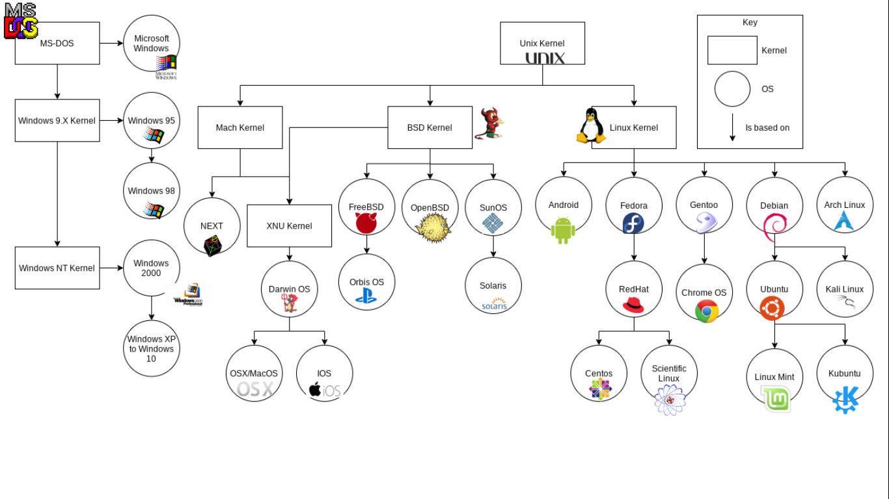
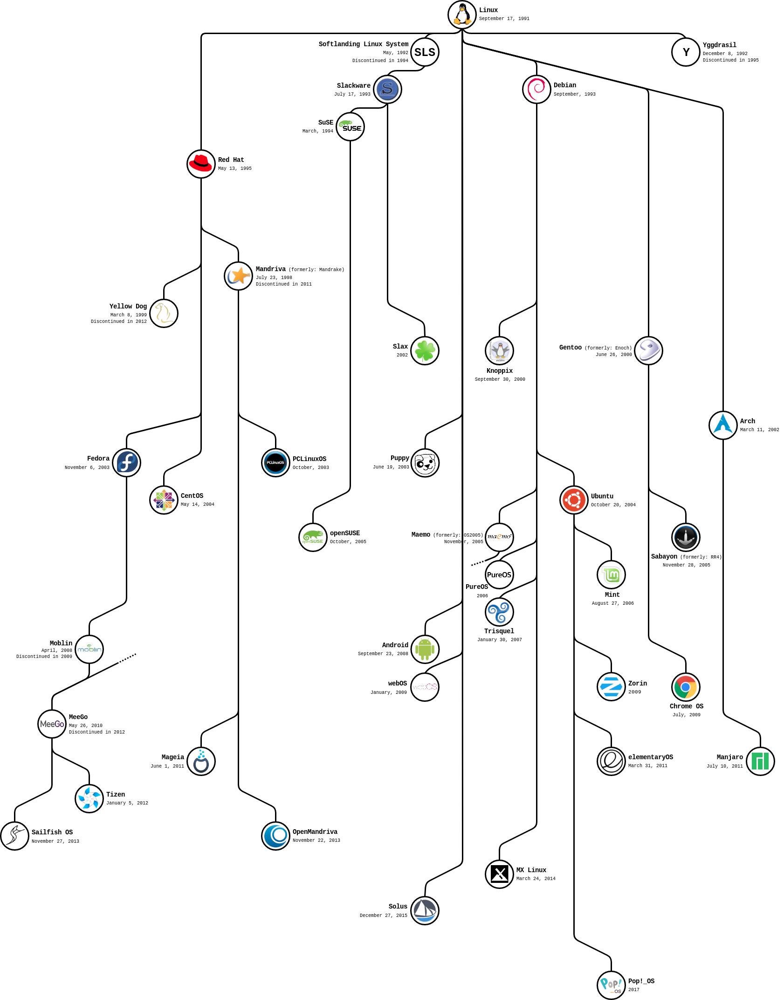

# OS History

### Outlines:

##### 1. Open Source & Closed Source

##### 2. Operating System Difinition & Layers

##### 3. History

##### 4. Linux Distros

---

## 1. Open Source & Closed Source

- ### Open Source
  _Open source software is software with source code that anyone can inspect, modify, and enhance._

    

---

- ### Closed Source
  _Closed-source software refers to software products whose creators restrict the use of its source code._

    

---

- ### Open Source vs Closed Source

    

---

- ### Examples

    

---

## 2. Operating System Difinition & Layers

**_An operating system (OS) is system software that manages computer hardware and software resources, and provides common services for computer programs._**

 

    

### Operating System Layers

 

    

---

## 3. OS History

### Before 1964

**_operating systems was one tasking operating system like batch processing os, time sharing os, ..._**

### In 1964

- MIT => edu (Project Owner)
- GE (General Electric) => $$, hardware
- Bell Labs now is AT&T => research => implementation

DARPA net (USA of Defense) support project

target: time sharing operating system

---

### Between 1965 => 1968

#### Multics OS (Multi information and Computer Services):

**1. Ring Protection (level0,1,2,3)**
**2. File Hierarchy**
**3. Dynamic Linking**
**4. Multiprocessing**
**5. Online reconfiguration**
**6. ACL (Access Control List)**

**Multics OS not success**

    
    

 

**Bell Labs engineer refused the ring desing**

**Ken Thompson & Dennis Retchie Last 2 left project**

 

    
     
    
Ken Thompson (left) with Dennis Ritchie (right)

    
     
    
Alan Turing The Once Obscure Father of Computer Science

 

### 1970

**Ken Thompson Develop Unics**

    
    

 

**Unics (Uni information and Computer Services)**

 

    

**Dennis Retchie develop C Lang**

    

**Brain Kerningan write most popular c lang book with dennis retchie.**
**Suggest to Convert Unics to _`Unix`_**

    

### 1971-1972-1972

**unix v1, unix v2, unix vn....**

**published in university -> free releases**

---

### 1976

#### Berkeley University

    

**Bill Joy post graduated student is original author of vi, csh,apps like ed, joe, TCP/IP....**

    

    1977,78,79
     
    BSD 1,2,3
     
    BSD v3 added virtual memory implementation
    

        
         
         
        
         
         
         
        
    

---

### unix -> license

1981 SYS III
 
1982 SYS V

1. IBM buy license => AIX
2. HP buy license => HP UX
3. Apple buy license => MAC OS X
4. Sun buy license => Sun Solaris

DARBA => TCP/IP
BSD 4.3 implement TCP/IP v1

Net/1,2

- 386 BSD
  - Free BSD
  - NetBSD
    - OpenBSD
- BSD Inc

UCL vs BSD

researches left bell labs (richard stallman,....)

    
    

---

## 1983 -> 1991

GNU Project => GNU Not Unix
 
target => programs then kernal
 
write apps, libs, shell, compiler like gcc
 
but not write kernal

---

## 1987

Andrew S. Tanenbaum write MiniX OS
 
microkernal and very small os (12,000 line of code)

    
    

    

---

## 1974

    Gary Kildall
     
    DRI: Digital Research Inc
     
    CP/M: assembly

    

---

    SCP
     
    1.5 month
     
    tim paterson: 86-Dos: Disk based operating system

    

---

    MS:
     
    1. Basic Interpreter
     
    2. Xenix OS
     
     
    IBM want os for thier PC then deal with MS
     
    MS Buy 86-Dos From SCP = 25,000$ with non exclusive rights
     
    MS failed to run 86-Dos on IBM PC
     
    tim paterson work on MS and take 2 month to run 86-Dos on IBM PC
     
    MS buy all 86-Dos rights from SCP = 50,000$
     
    MS earn 70,000,000$
     
    MS-Dos -> win 95,98,2000,....,11

    
    
    

---

Apple Lisa OS based on free BSD
 
MAC OS X kernal based on free BSD

    
    
     
    

---

    appliances
     
    1. routers
     
    2. switches
     
    3. firewalls
     
     
    all based on free BSD
     
     
    Sony PlayStation based on free BSD

    
    

---

## 1991

fresh graduated student [linus torvaldos]
 
 
write linux kernal
 
support multithreading
 
 
1994
 
linux -> 1.0.0
 
 
GNU/Linux Not Linux only

    
    
    

---

## 4. Linux Distros

1. Red Hat
   1. RHEL
      1. CentOS
      2. Scientific Linux
         1. Heli OS
   2. Fedora
      1. Fedora Server
      2. Fedora Workstation

---

2. Suse Linux
   1. SLES [Suse Linux Enterprise Server]
   2. Open Suse

---

3. Debian
   1. Ubuntu
      1. Ubuntu Server
      2. Ubuntu Desktop
      3. Linux Mint
      4. Parrot Security
   2. Kali Linux

---

5. Arch Linux
   1. Arch linux
   2. Manjaro
   3. Black Arch

---

    

---

    

---

## CLI vs GUI

    

---

 

### [outlines](../README.md)
