# Package Manager

#### Introduction:

A package manager, also known as a package management system, is a tool extensively used in Linux-based operating systems to simplify the installation, upgrading, and removal of software packages. This report aims to provide an overview of package managers in Linux, including their importance, different types, and their functionality.

#### Importance of Package Managers:

Package managers play a vital role in managing software packages in Linux distributions. They provide a centralized, automated system for handling software installations and updates, ensuring efficiency and ease of use. By utilizing package managers, users can easily install, upgrade, and remove software packages without the need for extensive manual processing.

#### Types of Package Managers:

1. dpkg: Developed by Debian, dpkg is a low-level package manager used primarily in Debian-based distributions such as Ubuntu. It handles the installation and management of individual software packages.

2. Advanced Packaging Tool (APT): Built upon dpkg, APT is a higher-level package management system. APT manages a package repository and resolves software dependencies, making it easier to install and update packages along with their dependencies.

3. Red Hat Package Manager (RPM): RPM is the default package manager used in Red Hat-based distributions like Fedora and CentOS. Similar to dpkg, RPM handles individual package installations, upgrades, and removals.

4. Yellowdog Updater Modified (YUM): Based on RPM, YUM provides advanced package management capabilities, including dependency resolution and automatic updates. It simplifies the installation and updating of software in Red Hat-based distributions.

### Key Functionality of Package Managers:

1. Dependency Resolution: Package managers analyze and resolve dependencies, ensuring that all required software components are installed correctly. This automatic handling of dependencies simplifies the installation process.

2. Software Repository Management: Package managers maintain repositories that contain software packages. These repositories provide a centralized location for finding and installing software, ensuring security and reliability.

3. Install/Upgrade/Remove Packages: Package managers allow users to easily install, upgrade, and remove software packages. They handle all required tasks behind the scenes, such as fetching packages, extracting files, and managing configurations.

4. Update Management: Package managers provide mechanisms for updating software packages. Users can receive notifications about available updates and install them with a single command, ensuring that their system remains up to date.

#### -Update

```
#yum update
```

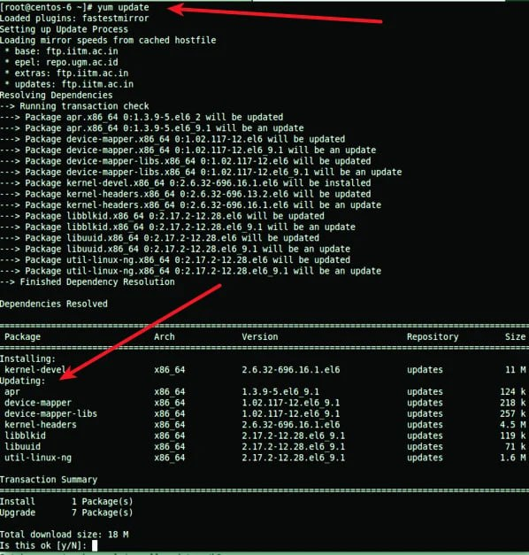

#### -Searching

The "yum search" command is used in Linux operating systems to search for packages in the available software repositories. It allows users to find packages that match a specific keyword or phrase.

```
#yum search package_name
```

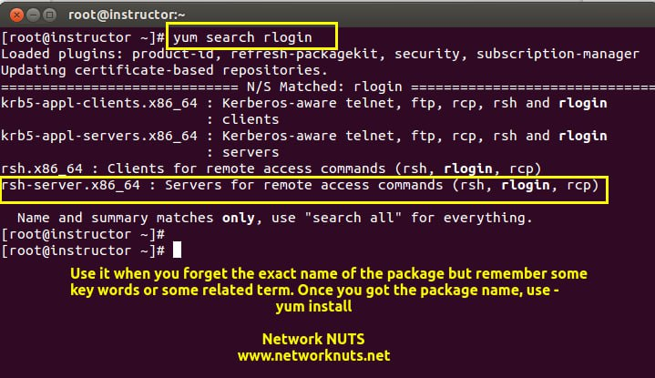

#### -Installation

```
#yum install package_name
```

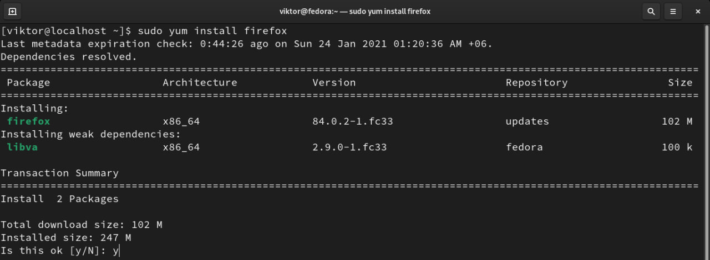
=> when you install a package the dependencies installed before the application you want

#### -Removing a package

```
#yum remove package_name
```

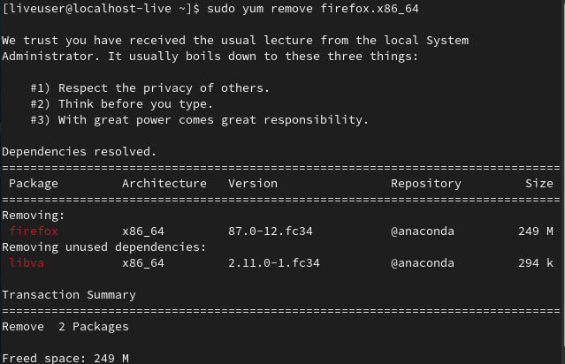

#### -Getting information about a package

```
#yum info package_name
```

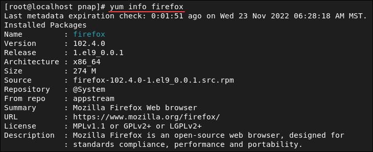

#### -Display a list of the enabled repositories on the system

```
#yum repolist
```

It will show the repository ID, repository name, and status (enabled or disabled) of each repository present on the system. This command is helpful in checking the available repositories and their status before installing or updating software packages using yum package manager.Stored at `/etc/yum.repo.d/`
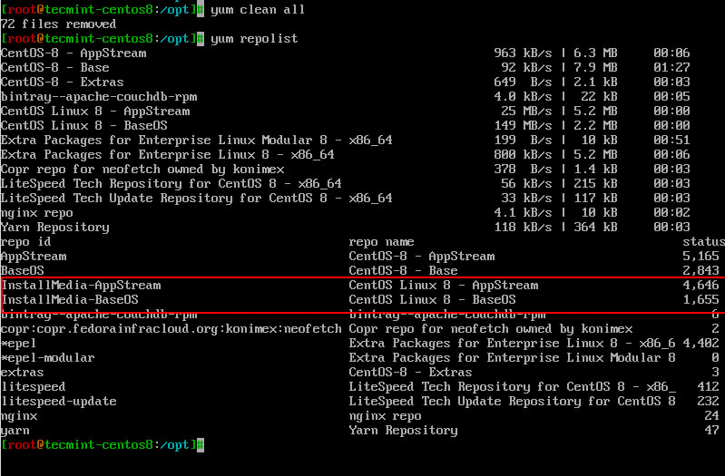
=>The "yum clean" command is used to clean the cache and remove unnecessary packages or files that were cached by the yum package manager.

### package group

**A package group** is a collection of related packages that can be installed together. The grouplist command displays the available groups along with a brief description of each group. It helps users to easily identify and install a specific group of packages based on their requirements.

#### listing all available package groups

```
#yum grouplist
```

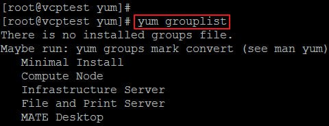

#### groupinstall

```
#yum groupinstall group_name
```

`yum groupinstall` is a command in Linux that allows you to install multiple software packages at once by specifying a group instead of individual packages. It installs all the default packages associated with a particular software group.For example, if you want to install all the packages related to the "Development Tools" group, you can use the following command:

`$sudo yum groupinstall "Development Tools"`

This command will install all the packages included in the "Development Tools" group on your Linux system. This can be a convenient way to install a set of packages that are commonly used together for a specific purpose or development environment.
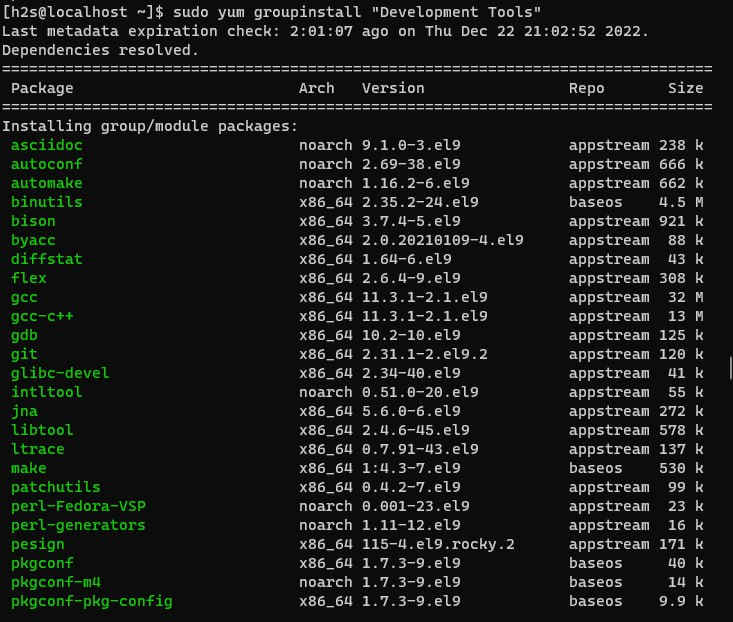

---------------------
# RPM (RPM Package Manager)

**RPM** is a popular package management tool in Red Hat Enterprise Linux-based distros. Using RPM, you can install, uninstall, and query individual software packages. Still, it cannot manage dependency resolution like YUM. RPM does provide you useful output, including a list of required packages. An RPM package consists of an archive of files and metadata. Metadata includes helper scripts, file attributes, and information about packages.

**RPM has some basic modes**: query, verify, install, upgrade, erase, show querytags, show configuration. At least one of these modes needs to be selected to perform package management tasks. Every mode has its own set of options. For example, install mode i has its own set of installation options. Options for the modes are found on the RPM man pages at [man rpm].

-Some commonly-used modes are listed below:
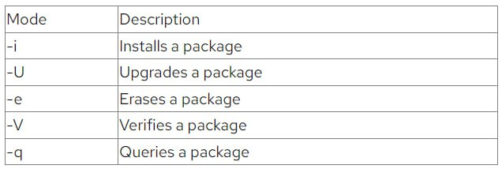

-Here are some commonly-used general options:
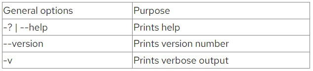

#### To install or upgrade an .rpm package using RPM, issue this command:
```
#rpm -i package-file
#
#rpm -U package-file
#
#rpm -ivh package-file
```
The flag -i is for install, U is for upgrade, v for verbose, h for hash (this option displays the # as a progress bar for the operation). In this example, v and h are optional flags.
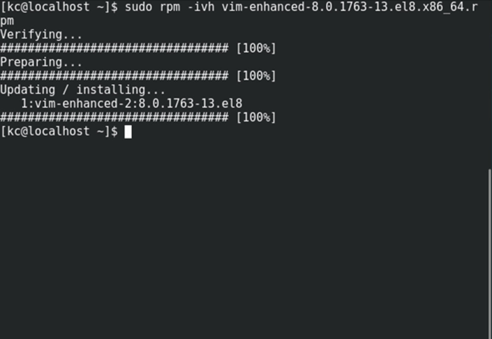

#### To query for a package using RPM issue following command:
```
#rpm -q query-options package
```
**EX**. rpm -qa vim-enhanced  —> Option a queries all installed packages on the system.
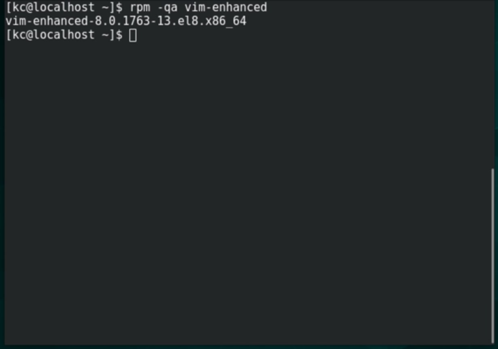

#### To erase a package, use the following command:
```
#rpm -e erase-options package-name
```
**EX**. rpm -evh vim-enhanced
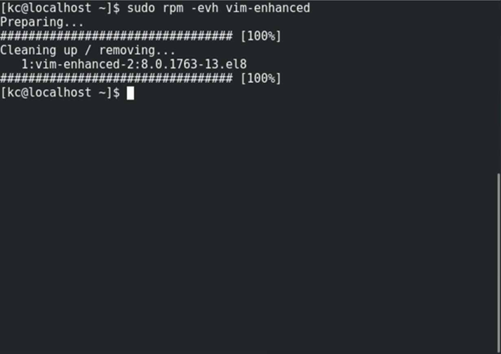