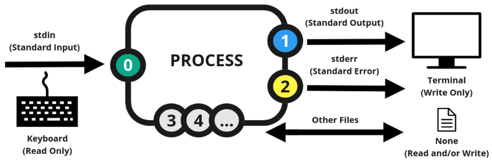
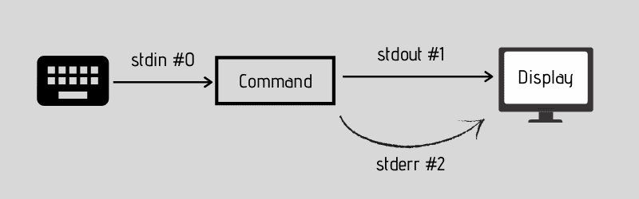

# Redirection 

<div align="center">
    
</div>
<br/>

- When you run a Linux command, there are **three data stream** that play a part in it:<br/><br/>
    - Standard input `<` (**stdin**) : is the source of **input data**. By default, stdin is any text entered from the **keyboard**. Its stream ID is **0**.<br/><br/>
    - Standard output `>` (**stdout**) : is the **outcome** of command. By default, it is displayed on the **screen**. Its stream ID is **1**.<br/><br/>
    - Standard error `>` (**stderr**) : is the **error message** (if any) produced by the commands. By default, stderr is also displayed on the **screen**. Its stream ID is **2**.<br/><br/>

<div align="center">
    
</div>
<br/> 

- you can **redirect** the stdin, stdout, and stderr from its usual destination to another **file or command** (or even peripheral devices like printers).<br/><br/>

___

### The output redirection (stdout)

<div align="center">
    
</div>
<br/> 

-  the output of a command is displayed on the screen, With output redirection, you can redirect the output to a file. If this output file doesn’t exist, the shell will create it.<br/><br/>

- for example : 
<div align="center">
    
</div>
<br/> 

- **append, instead of overwriting** , using the `>>` redirection syntax.

___

### The input redirection (stdin)

<div align="center">
    
</div>
<br/> 

- You can use stdin redirection to pass the content of a text file to a command.<br/><br/>

- for example :
<div align="center">
    
</div>
<br/> 

<div align="center">
    
</div>
<br/> 

___

### Error redirection (stderr)

- Sometimes when you run some command or script, you’ll see that it displays an error message on the screen. You may redirect the stderr as well.<br/><br/>

- for example :
<div align="center">
    
</div>
<br/> 

___

### Pipe redirection

<div align="center">
    
</div>
<br/> 

- With pipe redirection, you send the **standard output of a command** to **standard input of another command**.<br/><br/>

```
   command 1 | command 2
```

<br/>

- for example :
<div align="center">
    
</div>
<br/> 

<div align="center">
    
</div>
<br/> 