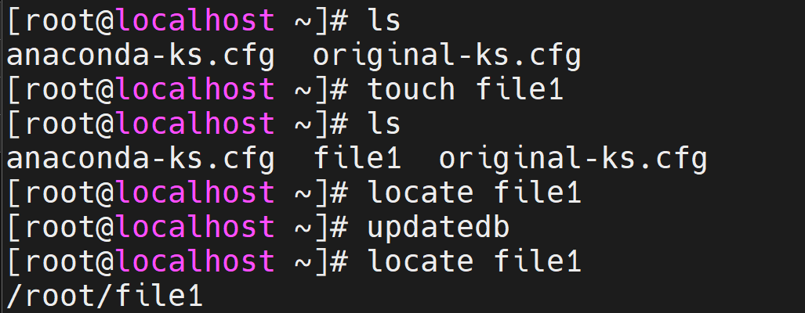

# Searching in Linux

- searching for commands ( ex: whatis, whereis, apropos, ....).
- searching for **files and directories** ( locate, find ).

<div align="center">
    
</div>
<br/>

### ( 1 ) Locate

- The `locate` command is **faster** than the `find` command because it uses a **previously built database**, whereas the `find` command searches in the **real system**, through all the actual directories and files.<br/><br/>
- The `locate` command returns a **list of all path names containing the specified group of characters**.<br/><br/>

- for example :

```
     locate   file1
```

<br/>

- `updatedb` command :

<div align="center">
    
</div>
<br/><br/>

### ( 2 ) Find

- The `find` command allows you to search for files and directories in a directory hierarchy based on a **user-given expression** and can perform user-specified action on each matched file.<br/><br/>
- the general form of the `find` command is :

```
   find    [path]    [options]    [expression]
```

<br/>

- here are some options we use with the `find` command :

|Option| Description                                               |
|----------|-------------------------------------------------------|
|**-type** | Find files and directories of a specific type.        |
|**-name** | Find files and directories by name.                   |
|**-iname**| Find files and directories by name (case-insensitive).|
|**-size** | Find files and directories by size.                   |
|**-user** | Find files and directories by their username.         |
|**-group**| Find files and directories by their group name.       |
|**-inum** | Find files and directories by their inode number.     |
|**-perm** | Find files and directories by its permission.         |

___

# Filtering in Linux

<div align="center">
    
</div>
<br/><br/>

### Grep 

- The `grep` command is a convenient utility we use to search for **text in files**. <br/><br/>

- the general form of the `grep` command is :

```
   grep     [options]     search_string       path_to_file
```

<br/>

- here are some options we use with the `grep` command :

|Option  | Description                                                    |
|--------|----------------------------------------------------------------|
| **-i** | Forgets about case sensitivity.                                |
| **-v** | Return all lines which don't match the pattern .(inverse)      |
| **-n** | Show the line numbers of the matches.                          |
| **-R** | Search for words in a directory or group of files. (recursive) |