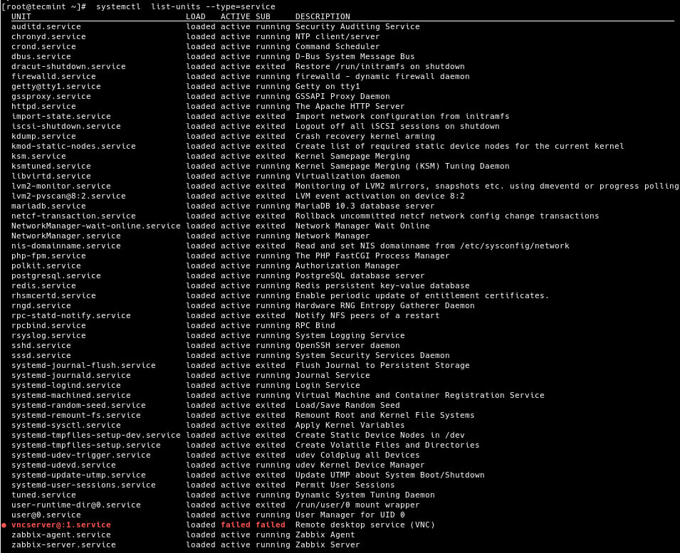
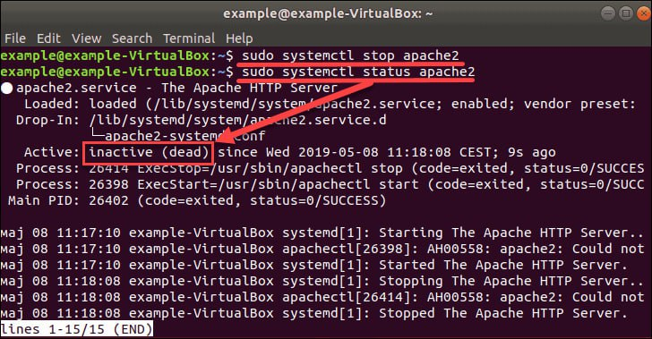
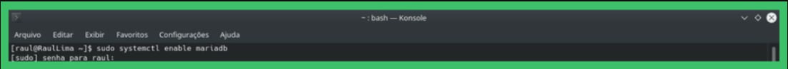

# Init and Systemd

## init

**Init is the first process to start when a computer boots up and runs until the system shuts down. init stands for initialization. In simple words the role of init is to create processes from script stored in the file /etc/inittab which is a configuration file which is to be used by initialization system**

**Some time ago it was determined that a replacement was needed to modernize the process and so systemd was created**

## Systemd

**systemd is a software suite that provides an array of system components for Linux[6] operating systems. The main aim is to unify service configuration and behavior across Linux distributions.[7] Its primary component is a "system and service manager**

**_the main command in systemd_**

```
systemctl [option] service_name
```


## How does systemd work?

systemd uses unit files to control related processes. A unit configuration file contains all the elements necessary to operate a service: a listening socket, device, mount point, automount point, swap file or partition, startup target, watched file system path, timers, temporary system state snapshot, resource management slice, or a group of externally created processes. This simplifies system administration, as systemd tracks and manages all the elements necessary for a particular service, and the administrator has only a single service unit file to manage for any service.

Unit files are customizable, and simpler and easier to understand than SysV and LSB init scripts.

## Benefits of systemd

systemd provides a number of benefits. It is a single daemon that performs complete process management, from startup to shutdown. It speeds up boot times by parallelizing service starts. It conserves system resources by starting services on demand, and puts them to sleep when there is no demand. systemd reduces complexity and increases efficiency by opening listening sockets, which are then available when services start, and the administrator does not have to worry about starting them in the correct order.

In contrast, SysV and LSB init only start services at boot, then exit. The SysV and LSB init administrator must configure services carefully to start in the correct order, for example networking must start before network services, and the administrator must remember to configure all necessary services to start at boot.

systemd is written in C, in contrast to the large assortment of shell scripts that comprise SysV and LSB init. The compiled single systemd binary is faster and more efficient than masses of scripts.

systemd provides unified logging for all processes with the systemd journal, which is viewed with the journalctl command.

systemd organizes processes with Kernel Control Groups (cgroups). cgroups are inbuilt in the Linux kernel. This provides an extremely efficient way to organize all related processes for a service, and to quickly find which process belongs to which service. cgroups also provide resource management, such as CPU, memory, I/O, and device groups.

The systemctl command is the systemd and service manager.

journalctl and systemctl replace a host of legacy commands and scripts.

systemd is backwards-compatible with SysV and LSB init.

---

#Init Run Levels VS Systemd Targets

## Init Run Levels

**A run level** is a state of init and the whole system defines what system services are operating. Run levels are identified by numbers. Runlevel is a mode or state in which a Linux system operates. It has a crucial role in the management of the Linux System.

| Runlevel | Description                                                                                                                    |
| -------- | ------------------------------------------------------------------------------------------------------------------------------ |
| 0        | System halt i.e., the system can be safely powered off with no activity.                                                       |
| 1        | Single user mode.                                                                                                              |
| 2        | Multiple user mode with no NFS (network file system).                                                                          |
| 3        | Multiple user modes under the command line interface and not under the graphical user interface.                               |
| 4        | User-definable.                                                                                                                |
| 5        | Multiple user mode under GUI (graphical user interface) and this is the standard runlevel for most of the LINUX-based systems. |
| 6        | Reboot which is used to restart the system.                                                                                    |

<br>

#### -How to check Runlevel of our Linux system

```
#runlevel
```


#### -How to Change the Runlevel

```
#init runlevelNumber    (init = telinit)
```

## Systemd Targets

#### What is a systemd Target

In SysVinit systems, you had a defined but configurable set of runlevels numbered from 0 to 6. A runlevel is essentially a set of capabilities or running services that you can predefine and set the system to boot to so you have a predictable set of services.

In systemd, **targets** are the new runlevels. For example, the default.target file is typically a symbolic link to another target file such as the graphical.target file. Targets directly correspond to the SysVinit runlevels in that you can match them up as shown below:

| Runlevel | Target File       | What it does?                                                                          |
| -------- | ----------------- | -------------------------------------------------------------------------------------- |
| 0        | poweroff.target   | Shuts down and power offs the system                                                   |
| 1        | rescue.traget     | Configures a rescue shell session                                                      |
| 2        | multi-user.target | Sets the system to non-graphical multi-user system, typically with no network services |
| 3        | multi-user.target | Sets the system to non-graphical multi-user system with network services               |
| 4        | multi-user.target | Sets the system to non-graphical multi-user system with network services               |
| 5        | graphical.target  | Sets the system to graphical multi-user system with network services                   |
| 6        | reboot.target     | Shuts down and boots the system again                                                  |

#### Setting a default target

**what is default target mean?**

**A default target** refers to the run-level or target that the system is set to start up with during booting. A target is a specific state or configuration that the system should be in. The default target determines which services should be started and which should be stopped as the system boots up.

-**To know what is the default target we use:**

```
#systemctl get-default
```

-**To set a default target we use:**

```
#systemctl set-default targetName
```


-**Using isolate command**
By using the "isolate" command with a target name, you can switch the system to that target and directly activate the services associated with that target. This effectively isolates the system and transitions it to the specified target state.

```
#systemctl isolate targetName
```


systemd configration files is in `/etc/systemd`
systemd files is in `/usr/lib/systemd`
when you enable a service a soft link will be created in `/etc/systemd/system` and when you disable this service the soft link will be removed

-**To list all loaded services on your system (whether active; running, exited, or failed,)**

```
#systemctl list-units
```



---

#### How to start, stop, restart, enable, disable and mask services using systemd.

-**Start Service**

```
#systemctl start service
```

The command start serves for starting (activate) one or more units specified on the command line.


-**Stop Service**

```
#systemctl stop service
```

The command stop serves for stopping the service or (deactivate) one or more units specified on the command line.


-**Command Status:**

```
#systemctl status service
```

The command status serves to check the status of the service. Show terse runtime status information about one or more units, followed by the most recent log data from the journal. If no units are specified, show system status.


-**Restart Service**

```
#systemctl restart service.service
```

The command restart serves for restarting the service in execution. Stop and then start one or more units specified on the command line. If the units are not running yet, they will be started.


-**Enable service**

```
#systemctl enable name_service
```

The enable command serves for executing the service since the initialization if consists of one or more units or unit instances. This will create a set of symlinks, as encoded in the [Install] sections of the indicated unit files. the system manager configuration is reloaded (in a way equivalent to daemon-reload), in order to ensure the changes are taken into account immediately.



-**Disable Service**

```
#systemctl disable name_service
```

The disable command serves for withdrawing the service since the initialization of one or more units. This removes all symlinks to the unit files backing the specified units from the unit configuration directory and hence undoes any changes made by enabling or link.


-**Masking Service**
Masking services using systemd is a way to prevent a service from starting automatically and disable its management through systemd. This can be useful when you do not want a particular service to start on boot or when you want to prevent accidental activation or modification of a service.

```
#systemctl mask service
```

This creates a symlink to `/dev/null` to disable the service.

Once a service is masked, it cannot be started or managed through systemd. Attempting to start the service with `systemctl start example.service` will result in an error. However, this does not completely remove the service from the system; it only prevents systemd from controlling it.

To unmask a service and revert it to its original state, run the following command:

```
#systemctl unmask service
```

This will remove the symlink and allow systemd to manage the service again.

It is important to note that masking a service using systemd may have system-specific implications, so it's recommended to understand the consequences before masking any critical services.
