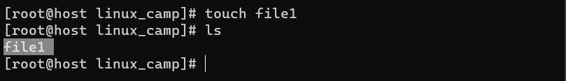
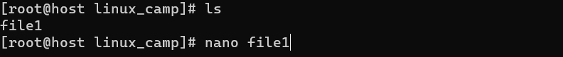
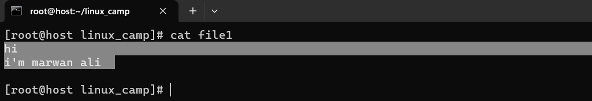
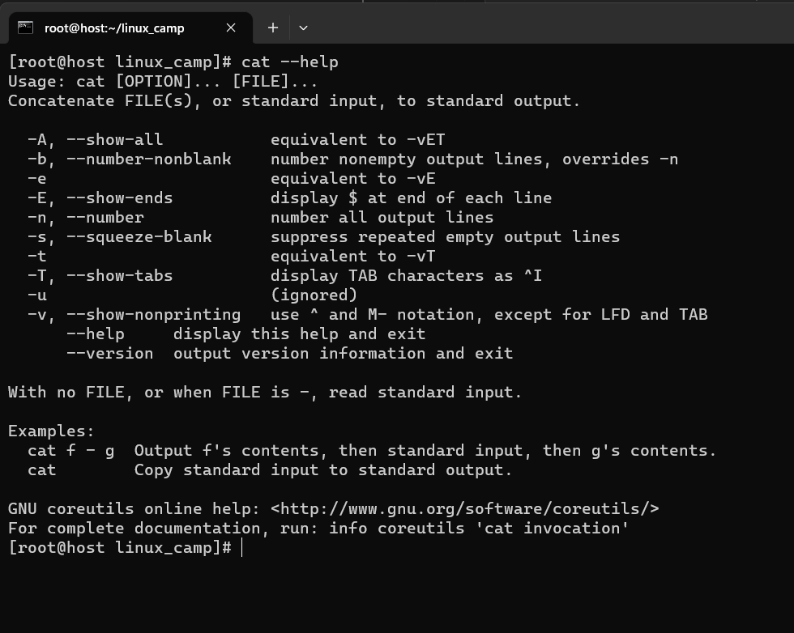
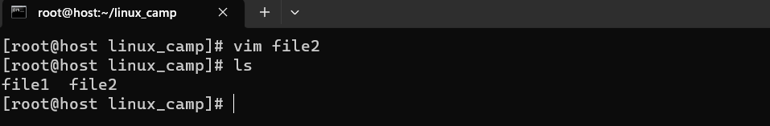
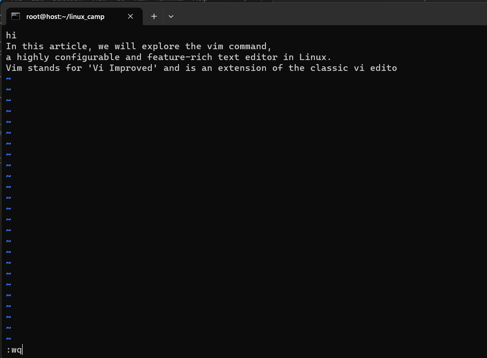
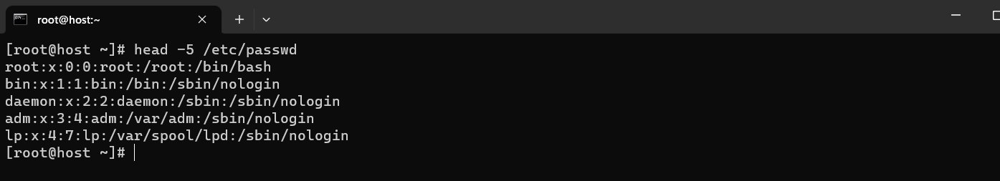
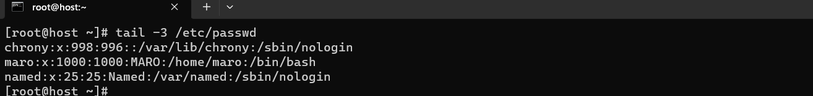

# text editors

**To create a text file**

```
touch file_name
```



---

**To write or edit text in a file**

```
nano file_name
```


.png>)

---

**To Displays the contents of files**

```
cat file_name
```




---

**To create, edit, and manage text files efficiently**

```
vim file_name
```




### **vim shortcuts**

[vim cheat sheet](https://infographicsite.com/infographic/infographic-the-beginners-vim-cheat-sheet/)

---

**TO displays the first few lines of a file**

```
head -n file_name
```



**TO viewing the last few lines of a file**

```
tail -n file_name
```



<br />

### [outlines](../README.md)

---

Author: Marwan Ali
