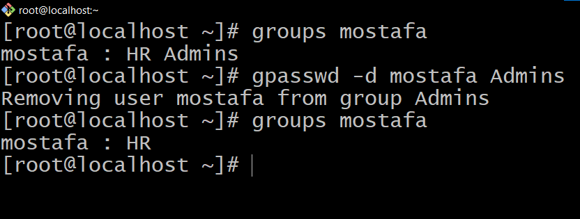

<!--
=>Users and Permissions
Descibe and define linux users and groups administration and descibe how set linux file system permissions on files and dirs.
-->

##Users and Permissions
##Users:
**there are three types of users:**

1. **Root user**:
   The superuser or administrator account that has complete control over the system. The root user has the highest level of privileges and can perform any task on the system and his id is 0 .

<br>

1. **System users or service users**:
   They are the software/application users created automatically by the system. And there id is from 1 to 999 .

<br>

1. **Normal users:**
   A normal user in Linux refers to a user account that does not have administrative privileges or root access. It is typically created for regular users to perform everyday tasks and access resources on the system. Normal users have limited permissions and can only modify their own files and directories, as well as run certain commands and programs that are allowed for their user group. The purpose of creating normal user accounts is to enhance security by preventing accidental or unauthorized modifications to critical system files and configurations. And there id is greater than or equal to 1000

###Adding And Deleting Users:
**-adding user name:**

```
#useradd username
```


<br>

**-To get user id and some info for user:**

```
#id username
```


- user information stored in `/etc/passwd`

<br>

**-To make password for user:**

```
#passwd username password
```


- the passwords for users stored in `/etc/shadow` as a hash.

<br>

**-To switch from user to another**

```
#su username
```


<br>

**-deleteing user:**

```
#userdel username

#userdel -r username  (To delete user with his home dir)
```


---

##Groups
**The group** is a logical collection of users that have certain permissions and privileges to access files, directories, and execute programs. Groups serve as a way to organize and manage users and their access levels.

- user can be member in one or more secondary group but he has only praimary group

- group information stored in `/etc/group`
- group passwords stord in `/etc/gshadow`
  ###Adding And Deleting Group
  **-add group**

```
#groupadd groupname
```


<br>

**-delete group**

```
#groupdel groupname
```

---

**-add user to secondary group:**

```
#usermod -G groupname username
```


<br>

**-add user to another secondary group:**

```
#usermod -a -G groupname username
```


<br>

**-To change user's primary group:**

```
#usermod -g groupname username
```


<br>

**-Note:**
g->For primary group  
G->For secondary group
<br>

**-To remove user from a specific group:**

```
#gpasswd -d username groupname
```



---

---

#Permissions
**permissions** are a set of rules that determine who can access or modify files and directories. Permissions are crucial for maintaining security and preventing unauthorized access to sensitive data.

**There are three types of permissions in Linux:**

1. Read (r): Allows users to view the content of a file or directory.
2. Write (w): Grants users the ability to modify or delete a file or directory.
3. Execute (x): Gives users permission to run a file or access the contents of a directory.

**Permissions are assigned to three different categories of users:**


1. Owner[u]: The user who owns the file or directory.
2. Group[g]: A group of users who share similar access requirements.
3. Others[o]: All other users who do not fall under the owner or group category.
4. File type :  
   Some common file types in Linux include:

   1. Regular Files [-]: These are basic data files, such as text, binary, or multimedia files. They do not have any special formatting or structure.

   2. Directories[d]: These are folders used to organize and store files.

   3. Symbolic Links[l]: These are files that act as pointers or references to other files or directories.

   4. Pipes[p]: These are used for inter-process communication, allowing the output from one command to be directly inputted to another command.

   5. Sockets[s]: These files facilitate communication between different processes, whether on the same machine or over a network.

   6. Character Devices[c]: These files provide a means of accessing character-based devices, such as keyboards or mice.

   7. Block Devices[b]: These files provide access to block-based devices, such as hard drives or flash drives.

- Each file and directory in Linux has permission settings that specify access rights for all three categories. These permissions are displayed in the form of a series of letters denoting the categories and their respective permissions. For example, "rw-r--r--" signifies that the owner has read and write permissions, while the group and others only have read permissions.

  <br>
**EX:**


**There are two methods to give a permission for a file or a directory :**

- Symbolic.
- Numeric.

---

##How To Change Permissions

**We change permissions using `chmod` command**

####Symbolic method:

- To add permisssons to user or group or others or all

```
#chmod u+permission filename  (add permissions for the owner)
#
#chmod g+permission filename  (add permissions for the group)
#
#chmod o+permission filename  (add permissions for the others)
#
#chmod a+permission filename  (add permissions for the all)
```


<br>

- To add permisssons to (owner and group),(owner and others) and (group others)

```
#chmod ug+permisson filename  (add pemissions to owner and group )
#
#chmod uo+permisson filename  (add pemissions to owner and others )
#
#chmod go+permisson filename  (add pemissions to owner and group)
```


<br>

- To delete a permisson

```
#chmod u-permission  filename (to delete a permission to owner)
#
#chmod go-permission filename (to delete a permission to group and others)
#
#chmod a-permission  filename (to delete a permission to all)
#
#chmod -permission  filename (to delete a permission to all)
```


<br>

- To set permissions

```
#chmod u=permission  filename (to set a permission to owner)
#
#chmod go=permission filename (to set a permission to group and others)
```


<br>

- permissions with dirs

```
#chmod u+permisson dirname  (add permission to dir )
#
#chmod -R u+permisson dirname  (add permission to dir and it's content)
```


<br>

---

####Numeric method:
**Numeric permissions** in Linux refer to permissions represented by numbers instead of letters

-To calculate the numeric permission for a file or directory, you add the values of the desired permissions. For example, if you want to assign read and write permissions to the owner and group, but only read permission to others, you would add the respective values:

- Owner: r+w = 4+2 = 6
- Group: r+w = 4+2 = 6
- Others: r = 4

So the numeric permission for this file or directory would be 664.

-**The represntation of the permissions in numeric:**

> rw=4+2=6
> rx=4+1=5
> wx=2+1=3
> rwx=4+2+1=7

- **Examples:**
  **1.rwxr-xr--**
  u=rwx=4+2+1=7
  g=r-x=4+1=5
  o=r--=4
  permission is 754
  

  **2.rw--wxr-x**
  u=rw-=4+2=6
  g=-wx=2+1=3
  o=r-x=4+1=5
  permission is 635
  

- Note: In Numeric method you must set permission to owner,group,others.

---

###Changing The Ownership Of File Or Dir
-To change ownership

```
#chown username dir/file (change the owner)
#
#chown :groupname dir/file (change the group)
#
##chown username:groupname dir/file (change the owner and group)
```


