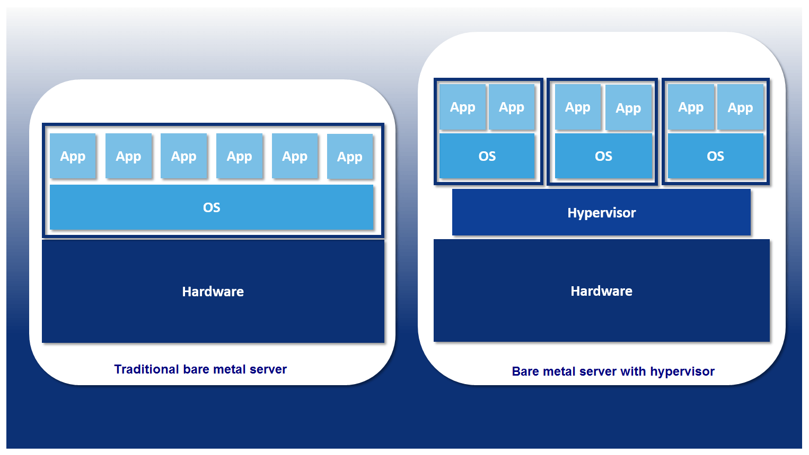
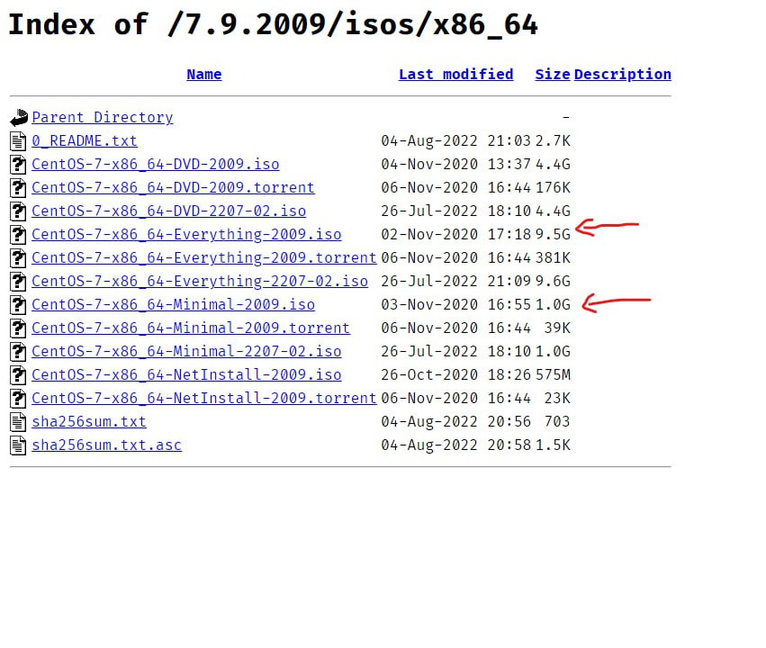

# Virtualization Technology

### Outlines:

##### 1. Virtualization Technology

##### 2. Hypervisor Type 1 & 2

##### 3. Linux Installation CLI

##### 4. Linux Installation GUI

---

## 1. Virtualization Technology

**_Virtualization is a technology that helps us to install different Operating Systems on a hardware. They are completely separated and independent from each other. In Wikipedia, you can find the definition as – “In computing, virtualization is a broad term that refers to the abstraction of computer resources._**

    

## Virtualization is often

- The creation of many virtual resources from one physical resource.
- The creation of one virtual resource from one or more physical resource.

---

## 2. Hypervisor Type 1 & 2

### Type 1 Hypervisors

_Type 1 or bare-metal hypervisor is a virtualization software used to create virtual machines on top of the computer hardware. Direct hardware installation allows Type 1 hypervisors to be fast, efficient, and have better security when compared to a Type 2 hypervisor._

    

#### The popular types of Type 1 hypervisors:

- VMware hypervisors like vSphere, ESXi and ESX.
- Microsoft Hyper-V.
- Oracle VM Server.
- Citrix XenServer.

---

### Type 2 Hypervisors

_A Type 2 or hosted hypervisor is a virtualization software installed on top of the host operating system that supports virtualization. Since it works on top of an operating system, Type 2 hypervisors are not as fast, efficient, or secure as Type 1 hypervisors. They are, however, sufficient for various Type 2 hypervisor applications, like using a virtual machine to test a new operating system._

    

#### The popular types of Type 2 hypervisors:

- VMware Workstation (Pro, Player).
- VMware Fusion
- Oracle VirtualBox
- KVM

---

### Type 1 Hypervisor vs. Type 2 Hypervisors: What's the Difference?

 
 

| Category            | Type 1                                                                                                              | Type 2                                                                                                 |
| ------------------- | ------------------------------------------------------------------------------------------------------------------- | ------------------------------------------------------------------------------------------------------ |
| Location Installed  | Directly installed on computer hardware                                                                             | Installed on top of the host OS                                                                        |
| Virtualization Type | Hardware virtualization                                                                                             | OS virtualization                                                                                      |
| Operation           | Guest OS and application on the hypervisor                                                                          | As an application on OS                                                                                |
| Performance         | Takes advantage of high-core count processors more efficiently, making it ideal for big and high-scaling operations | Adequate for testing, development, and tinkering                                                       |
| Security            | Direct hardware installation means each VM is very safe from all host OS vulnerabilities                            | Provides sandboxed guest OS making it adequately safe                                                  |
| Setup               | Easy but some technical knowledge required                                                                          | Quick and easy                                                                                         |
| Suited Hardware     | Type 1 hypervisors get their performance from high processor core counts; server-rated hardware is ideal            | Type 2 hypervisors are used for smaller-scale operations and convenience; better suited to PC hardware |

---

---

# Linux Installation

- CLI
- GUI

## Requirements

- Hypervisor
  - [vmware](https://www.vmware.com/mena/products/workstation-pro/workstation-pro-evaluation.html)
  - [Virtualbox](https://www.virtualbox.org/wiki/Downloads)
- ISO Image
  - [CentOS](https://centos.spd.co.il/7.9.2009/isos/x86_64/)

 

---

## 3. Linux Installation CLI wizard

**_Demo_**

---

## 3. Linux Installation GUI wizard

**_Demo_**

---

 

### [outlines](../README.md)
