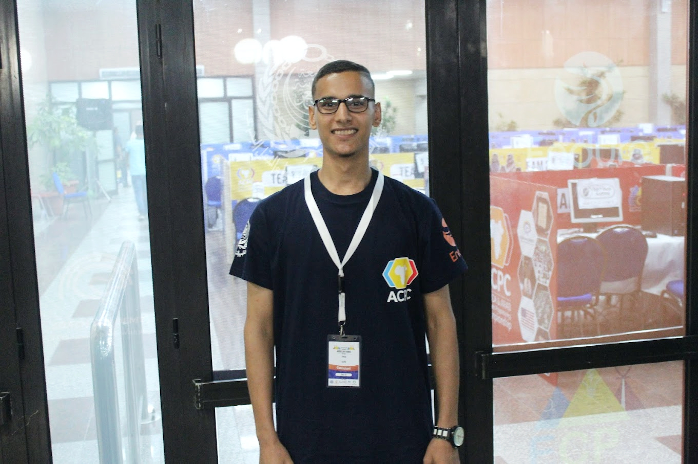
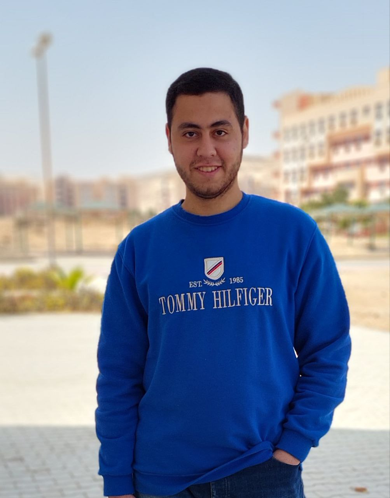
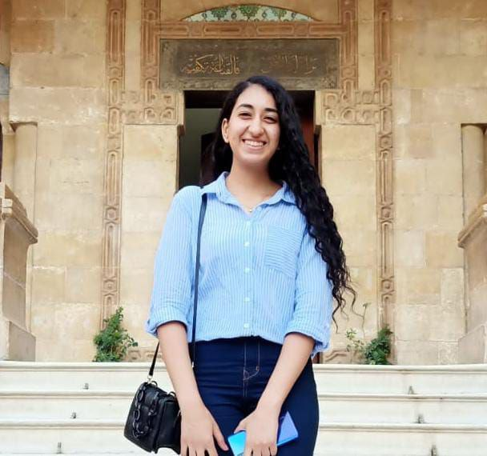

## ATHER TEAM

 <!-- summary about ather team here -->

---

- ### Abdullah Kamal

 

    

 
 

**_Hi, My name `Abdullah Kamal`. I'm `Backend Developer` and `Penetration Tester`, I have knowledge in many fields like Web Development, Database, Networking, System Administration, Web Penetration Testing and Network Penetration Testing. I participate in serveral Compitions like ECPC for Problem Solvers, ICMTC and Cybertalents for CTF Players. Interesting in Web Development, bug hunting and fix vulnerabilities._**

 

#### Contacts:

- ##### LinkedIn: [ak4m410x01](https://www.linkedin.com/in/ak4m410x01/)
- ##### Github: [ak4m410x01](https://github.com/ak4m410x01/)
- ##### Telegram: [ak4m410x01](https://t.me/ak4m410x01)

---

- ### Abdelaziz Hasan

**_Hi, my name is `Abdelaziz Hasan`, and I am a `Cloud Security Engineer` with a diverse skill set that spans across networking, operating systems, and cloud security. I am deeply passionate about learning and implementing DevOps tools to optimize cloud-based solutions.I am excited about the prospect of contributing to innovative and secure cloud-based solutions and collaborating with talented individuals in the field._**

 

#### Contacts:

- ##### LinkedIn: [Abdelaziz Hasan](https://www.linkedin.com/in/abdelaziz-hassan-5645a9243/)
- ##### Github: [Abdelaziz Hasan](https://github.com/AzHsn)
- ##### Telegram: [Abdelaziz Hasan](https://t.me/AZ_HnX0r)

---

- ### Mostafa Hazem Fathy

 

    

 
 

**_I am `Mostafa Hazem`. I'm a `cyber security engineer` with a passion for networks and information security, confident person who relishes challenges and working under pressure. My greatest strengths are my research and communication .I seek to develop myself in order to keep pace with the huge technological development._**

 

#### Contacts:

- ##### LinkedIn: [Mostafa Hazem](https://www.linkedin.com/in/mostafa-hazem-31628221a/)
- ##### Github: [Mostafa Hazem](https://github.com/MostafaHazeim25)
- ##### Telegram: [Mostafa Hazem](https://t.me/Mostafa_Hazeim_25/)

---

- ### Mohamed Mamdouh

 

    

 
 

**_I am `Mohamed Mamdouh`. I am `system administrator` and `Cloud & DevOps engineer` ,my passion lies in integrating development and operations processes to enhance software development efficiency and maximize business value. With a strong foundation in both development and operations, I strive to automate processes, improve productivity, and build scalable infrastructure through use of various DevOps tools and technologies._**

 

#### Contacts:

- ##### LinkedIn: [Mohamed Mamdouh](https://www.linkedin.com/in/mohamed-mamdouh-442ab223a/)
- ##### Github: [Mohamed Mamdouh](https://github.com/MoHaMeDMaMdouHFaDel)
- ##### Gmail: [Mohamed Mamdouh](00mansionmohamed00@gmail.com)

---

- ### Mariam Sameh

 

    

 
 

**_Summary :  i am Mariam Sameh, a network student with knowledge in networking , linux system administration, shell script and containers . I'm interested in the field of DevOps . Seek to know more about network security and clouding._**

 

#### Contacts:

- ##### LinkedIn: [Mariam Sameh](https://www.linkedin.com/in/mariam-sameh-8234691b5/)
- ##### Github: [Mariam Sameh](https://github.com/mariamsamehkhalaf)
- ##### Gmail: [Mariam Sameh](mariamsamehkhalaf@gmail.com)

---

<!--
- ### Member 6

 

    

 
 

**_Summary About Member 6_**

 

#### Contacts:

- ##### LinkedIn: [username](linkedin.com/in/username)
- ##### Github: [username](github.com/username)
- ##### Telegram: [username](t.me/username)

---

-->

## [outlines](../README.md)
